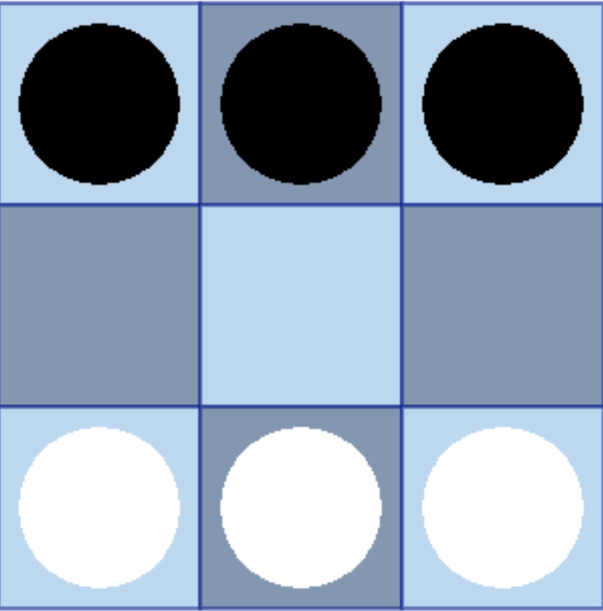

# Hexapawn_Love2d

#### ENG

A Love2d implementation of the famous game of Hexapawn invented by Martin Gardner and published in march 1962 on Scientific American.

This software focuses on the explainability of the moves selection operated by the algorithm, showing how, by losing games, it disables losing moves thus becoming more and more adept at this game.

This implementation is (for now) exclusively in Italian as it's planned to be showcased at the science fair "Trieste Next 2020".

#### ITA

Implementazione in Love2d del famoso gioco dell'esapedina inventato da Martin Gardner e pubblicato nel marzo 1962 sul Scientific American.

Il programma si focalizza sulla spiegabilità della scelta delle mosse operata dall'algoritmo, mostrando come, attraverso le sconfitte, diventi più esperto nel gioco stesso andando a "disabilitare" le mosse perdenti.

L'implementazione è attualmente solo in italiano in quanto è stata progettata per essere esposta alla fiera scientifica "Trieste Next 2020"

## Il gioco

Per maggiori dettagli, si rimanda all'articolo in Italiano di Martin Gardner pubblicato sul nr. 10 di "Le Scienze".

Si gioca su una scacchiera 3x3, con le pedine disposte come in figura:

Il giocatore umano muove le pedine bianche ed inizia la partita; l'algoritmo muove le pedine nere.

I movimenti sono analoghi a quelli dei pedoni di scacchi, quindi:

* Avanzamento di una casella in avanti (se libera), oppure
* Avanzamento di una casella in diagonale, se occupata da una pedina avversaria, con cattura di quest'ultima
* Non sono permessi *en-passant* o movimenti in avanti di due caselle

L'obiettivo del gioco è:

* Catturare tutte le pedine dell'avversario, oppure
* Raggiungere con una pedina la riga più lontana da quella di partenza, oppure
* Bloccare l'avversario in modo che non abbia più alcuna mossa a disposizione

Se il nero gioca in maniera intelligente, vince sempre la partita, indipendentemente dall'abilità del bianco.

## L'algoritmo

L'algoritmo di Gardner è progettato in maniera estremamente semplice.

Si ottengono tutte le possibili configurazioni di pedine nelle quali può trovarsi il nero quando è in procinto di muovere. Si rimuovono le configurazioni simmetriche che portano a ridondanza e lentezza nella convergenza dell'algoritmo.
Ad ognuna delle configurazioni rimanenti si fa corrispondere un contenitore.
In ogni contenitore si inserisce un numero di biglie colorate corrispondente al numero di possibili mosse per la corrispondente configurazione del contenitore. Ad ogni colore di biglia corrisponde una possibile mossa.

Giocando la partita, ogniqualvolta l'algoritmo deve muovere, si estrae una biglia dalla corrispondente configurazione e si esegue tale mossa: va da sé che, inizialmente, l'algoritmo muove in maniera completamente casuale.
Se l'algoritmo dovesse perdere, si rimuoverà dal contenitore corrispondente all'ultima mossa la biglia ivi estratta, assicurandosi che l'algoritmo non ripeterà mai più quell'errore.
Già dopo poche partite giocate, si noterà che l'algoritmo sarà sampre più "intelligente", fino a diventare pressoché imbattibile in una decina di partite.

### Dettagli implementativi

Ai fini della leggerezza del programma, non viene creata da subito una base dati con tutte le possibili configurazioni, ma questa viene costruita (aggiungendo i simmetrici) man mano che l'algoritmo incontra per una prima volta una data configurazione.

## Come giocare

Bisogna aver installato [Love 2d](https://love2d.org/).
Su iOS e Linux aprire un terminale, dirigersi nella cartella di questo progetto e digitare
`love .`

Su Windows è necessario digitare il percorso completo dell'eseguibile di Love2d (usualmente `C:\Program Files\LOVE\love.exe`) e digitare
`"C:\Program Files\LOVE\love.exe" .`

